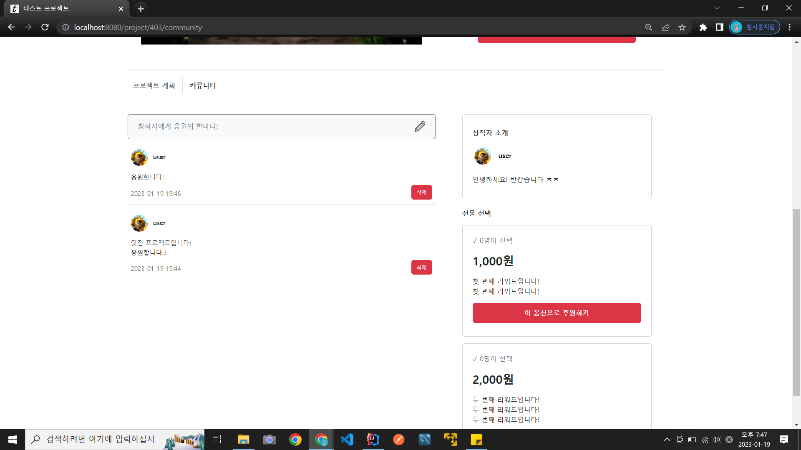

# 간소화한 텀블벅 웹사이트 만들기(클론코딩) 프로젝트

[ERD(링크)](https://www.erdcloud.com/d/7Ccv63mRFhyrDpd5C)

[예시 이미지 더보기(링크)](#예시-이미지)
## 구현 기능
* 회원가입, 로그인, 로그아웃
* 멤버 프로필 수정 (프로필 이미지, 사용자명, 비밀번호, 소개글 수정 가능)
* 멤버 프로필 조회 (올린 프로젝트, 후원 프로젝트, 팔로워/팔로잉 목록 조회 가능)
* 멤버 팔로우
* 프로젝트 등록, 상세 조회, 리워드별 후원
* 프로젝트별 응원글 작성, 삭제 기능 (커뮤니티)
* 카테고리별/인기/신규/마감임박 프로젝트 목록 조회 (정렬한 데이터 조회 기능)
* 프로젝트명/창작자명으로 프로젝트 검색
* 프로젝트 목록 페이징
* 데이터 수정/삭제 관련 접근 권한 설정

### 구현하지 않은 것
* 관리자 페이지
* 결제 기능

## 개발 타임라인
### 2022-11-20
* 프로젝트 시작
* 도메인 개발 완료
* 로그인/회원가입 화면 템플릿 작성 및 로직 생성 (인터셉터 적용은 추후에)

### 2022-11-21
* 프로젝트 등록 화면 템플릿 작성 및 로직 생성
* 프로젝트 상세 화면 템플릿 작성
* 네비게이션바 관련 템플릿 작성

### 2022-11-22
* 프로젝트 상세 화면 출력 로직 생성

### 2022-11-23
* 홈 화면 템플릿 작성
* 홈 화면 프로젝트 목록 출력 로직 생성 (4열로 출력)

### 2022-11-24
* 홈 화면 템플릿 작성 마무리 (인기 프로젝트 목록 생성)
* 네비게이션 바 링크 연결 + 로그인 여부에 따라 로그인/프로필 버튼 전환하는 기능 추가

### 2022-11-25
* 프로필 메인 페이지 템플릿 작성 및 로직 생성

### 2022-11-26
* 프로필 수정 기능 추가
* 프로필 올린 프로젝트 목록 출력 기능 생성
* 후원 기능 추가 (결제 기능은 X)

### 2022-11-27
* 프로필 후원 프로젝트 목록 출력 기능 생성
* 회원 팔로우 로직 생성
* 프로필 팔로워/팔로잉 목록 템플릿 작성

### 2022-11-28
* 프로필 사진 등록 기능 생성
* 프로필 팔로워/팔로잉 목록 출력 기능 생성

### 2022-11-30
* 페이징 관련 DTO 생성

### 2022-12-01
* 페이징 로직 완성
* 인기, 신규, 마감임박 페이지 템플릿 생성 및 출력 로직 생성

### 2022-12-02
* 네비게이션바 프로필 출력, 로그인 처리 관련 인터셉터 생성 및 등록
* 카테고리별 프로젝트 페이지 생성

### 2022-12-03
* 팔로우 취소 기능 생성
* 팔로우/팔로잉 버튼 전환 기능 생성

### 2022-12-04
* 검색 기능 생성 (동적 쿼리 작성에 Querydsl 사용)
* 로그인 상태에서 회원가입 페이지 접근 불가능하도록 로직 수정
* 한 유저가 동일 프로젝트를 여러 번 후원해도 프로필 후원 프로젝트 내역에 동일 프로젝트는 한 번만 표시되도록 수정

### 2022-12-06
* 프로필 유저, 로그인 유저 ID 비교 로직 수정 (오류 해결)
* 프로젝트 상세 화면 서브이미지 표시 기능 추가 (carousel)

### 2022-12-07
* 프로젝트 커뮤니티 글 목록 템플릿 작성

### 2022-12-09
* 프로젝트 커뮤니티 글 목록 출력 기능, 글 작성 기능 추가

### 2022-12-10
* 로그인/로그아웃 시 원래 있던 페이지로 리다이렉트 되도록 로직 수정
* 프로젝트 커뮤니티 글 삭제 기능 추가
* 프로젝트 마감기한 설정시 입력 포맷 'yyyy-MM-dd'로 바꾸기 (폼 데이터는 LocalDate로 받고 LocalDateTime으로 변환하여 저장하는 방식으로 구현)
* 프로젝트 커뮤니티 글 등록 템플릿 수정
* 프로젝트 설명란/커뮤니티 게시글/프로필 소개글 줄바꿈 출력 되도록 수정 (word-break도 적용)

### 2022-12-12
* 프로필 변경시 프로필 유저/로그인 유저 동일한지 확인하는 로직 추가
* 회원가입, 로그인, 프로젝트 등록, 프로필 수정, 커뮤니티 게시글 등록 폼 검증 기능 추가

### 2022-12-13
* 프로젝트 리스트 출력할 때 제목 2줄로 고정 (제목 칸 높이는 2줄 높이로 고정하고 넘치는 경우 말줄임표 넣도록 수정)

### 2022-12-14
* HTML title, viewport, favicon 설정

### 2022-12-19
* 프로젝트 상세 페이지, 커뮤니티 페이지 DB 접근 최적화 (페치 조인으로 해결)
* 데이터베이스 테이블 VARCHAR 자료형 컬럼 정의를 검증 최대길이에 맞게 변경

### 2022-12-20
* 프로젝트 상세 화면에 각 리워드 선택인원수 표시 기능 추가
* 마감기한 지난 경우 프로젝트 남은 시간이 음수로 표시되던 버그 수정
* 마감기한 지나면 프로젝트를 후원할 수 없도록 수정

### 2023-01-18
* 회원가입 후 로그인 화면으로 바로 넘어가도록 수정(리다이렉트 관련 쿼리 스트링은 계속 유지)
* 프로젝트 업로드 폼에서 마감기한 달력에서 선택할 수 있도록 수정
* project 엔티티에서 lastModifiedDateTime 필드 삭제
* UploadFile 임베디드 타입에서 originalFileName 필드 삭제
* repository 클래스에서 @Transactional 삭제
* service 클래스에서 읽기 전용 메소드에 @Transactional(readonly = true) 설정
* 검색 페이징 오류 수정

### 2023-01-19
* SHA-256 알고리즘 이용하여 비밀번호 암호화 (salt 포함)
* 리워드 설명글 줄바꿈 안 되는 오류 수정

### 2023-01-25
* MariaDB로 DBMS 변경
* AWS EC2 free tier 메모리 부족으로 querydsl 컴파일 불가(빌드 중 무한로딩) -> querydsl 코드를 jpa 코드로 변경
* AWS EC2를 이용하여 웹 애플리케이션 배포 완료

### 2023-03-07
* ERD 작성 (ERD Cloud 웹사이트 활용)
* 엔티티를 ERD에 맞게 수정
* 엔티티 필드명 일부 수정
* 임시 데이터 생성 로직 수정
* 이미지 파일 폴더 경로 프로젝트 내부로 

## 예시 이미지
* 업로드 페이지

* 프로젝트 상세 화면

* 프로젝트 커뮤니티

* 프로필 조회

